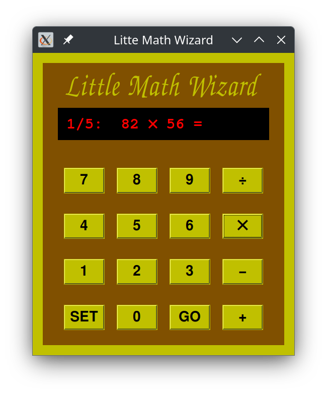

wizard_gui_v2.py

Copyright 2025 Nap0

This program is free software; you can redistribute it and/or modify
it under the terms of the GNU General Public License as published by
the Free Software Foundation; either version 2 of the License, or
(at your option) any later version.

This program is distributed in the hope that it will be useful,
but WITHOUT ANY WARRANTY; without even the implied warranty of
MERCHANTABILITY or FITNESS FOR A PARTICULAR PURPOSE.  See the
GNU General Public License for more details.

You should have received a copy of the GNU General Public License
along with this program; if not, write to the Free Software
Foundation, Inc., 51 Franklin Street, Fifth Floor, Boston,
MA 02110-1301, USA.

This is a small educational Python coding project made to learn more about Python and the Tkinter library.
"Little Math Wizard" is inspired by the "Little Professor" devices made bi TI. 
Similar to the TI devices it allows to exercise mental arithmetic, it offers 4 levels of difficulty.
Pressing a math operator (+,-,x,/) changes the math operation used.
